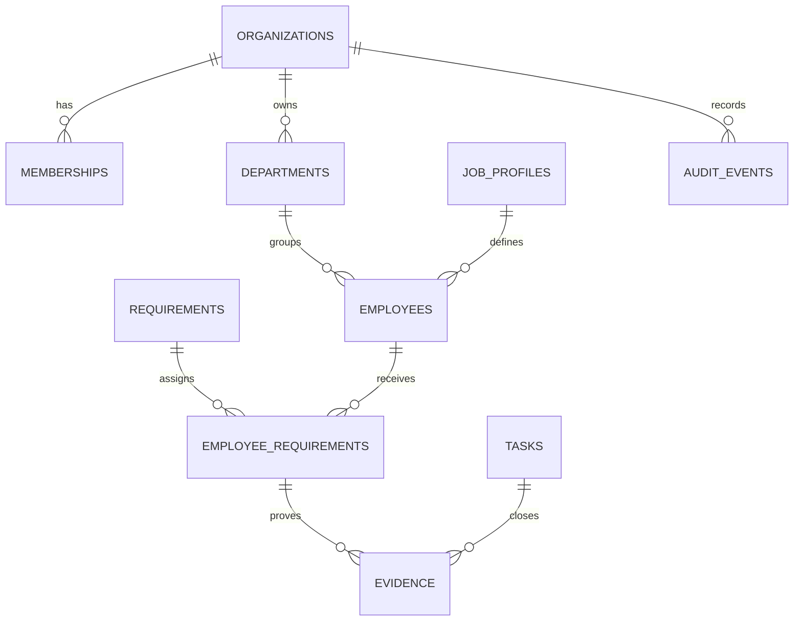

# HSE Radar — production architecture

## Canonical model

Canonical safety obligation is `employee_requirements`: requirement, employee, due date, owner, status, completion and independent verification. Existing production names are retained to avoid a breaking migration:

| Requested name | Production name |
|---|---|
| organization_members | memberships |
| positions | job_profiles |
| audit_logs | audit_events |

All business rows carry `organization_id`. RLS is the hard security boundary; URL filters and UI visibility are only convenience layers.

## Authorization

The TypeScript matrix lives in `lib/permissions.ts`. PostgreSQL enforces the matching capabilities through `has_permission(org_id, permission_key)`. UI checks never replace RLS.

Roles: owner, HSE, manager, HR, member, viewer. Owner receives every capability. Only owner manages membership and organization settings.

## Audit

Critical tables use database triggers. The audit table rejects UPDATE and DELETE, including privileged application paths. Request metadata stores a SHA-256 hash of the forwarded IP rather than the raw address.

## Documents

The `hse-documents` bucket is private. Object paths begin with organization UUID. Access is controlled by storage RLS and downloads use short-lived signed URLs. Database backups do not contain Storage objects; Storage requires a separate backup job.
